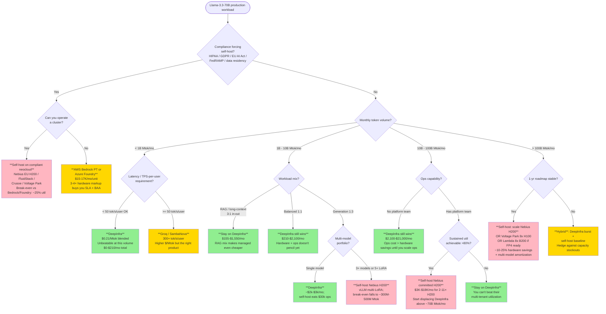

# 20 — Self-Host vs Managed Inference Break-Even (Llama-3.3-70B)

**Date:** 2026-05-25  •  **Round 4 deep dive**  •  **Reference managed price:** DeepInfra Llama-3.3-70B-Turbo (FP8) **$0.10 in / $0.32 out** per Mtok
**Blended price used:** $0.21/Mtok (1:1 input:output, the Round 2 convention). Sensitivity to RAG-heavy 3:1 ($0.155) and gen-heavy 1:3 ($0.265) blends shown in §1.3.
**Throughput convention:** "tokens/sec" = combined input + output throughput sustained under continuous batching, FP8 (Hopper) or FP4 (Blackwell), batch sized for the production-realistic 50-75 TPS/user interactivity target.
**Hours/mo:** 730. **Capacity formula:** `Cap_Mtok = TPS × 730 × 3600 / 1e6`.

---

## 0. TL;DR

1. **At $0.21 blended, DeepInfra is the price floor for any volume below ~700M Mtok/mo.** Hardware alone cannot beat it once you load even thin ops cost.
2. **The user's conservative throughputs (1,500/1,800/8,000/9,500/25,000 tok/s) are too low** by 30-100% versus what MLPerf v5.0/v5.1, InferenceMAX v1, and the Baseten GH200 vLLM test report. Refined throughputs and the impact on break-even are in §2.
3. **The only platform whose raw GPU $/Mtok dips below DeepInfra at full utilization is Nebius committed H200** ($0.168/Mtok at 3,800 tok/s) — and only with sustained >80% utilization, which requires a steady production load, not an experiment.
4. **DeepInfra is unbeatable on cost up to roughly 100M-1B Mtok/mo.** Above that volume, self-hosting on Nebius H200 (or Voltage Park 8×H100 if you want bare-metal control) starts to win — but the *real* threshold including ops staff is **700M-1.5B Mtok/mo**.
5. **Below ~700M Mtok/mo, self-host only makes sense for non-cost reasons**: data residency, compliance (GDPR/HIPAA/EU AI Act), latency SLOs that DeepInfra can't meet, model customization (LoRA, fine-tune, system-prompt sovereignty), or strategic supplier hedging.
6. **Multi-model serving (multi-LoRA on shared base)** improves self-host economics by 2-3× — but it's an architectural commitment, not a cost lever you flip at break-even.

---

## 1. Per-Platform Break-Even Math

### 1.1 User-stated throughputs (the prompt's assumptions, conservative)

| Platform | $/mo | tok/s sustained | Cap Mtok/mo @100% util | $/Mtok @100% | Break-even vs DeepInfra @ $0.21 |
|---|---|---|---|---|---|
| Vultr 1× GH200 | $1,433 | 1,500 | 3,942 | $0.364 | **6,824 Mtok/mo = 173% util — unreachable** |
| Lambda 1× GH200 | $1,672 | 1,500 | 3,942 | $0.424 | **7,962 Mtok/mo = 202% util — unreachable** |
| Nebius committed 1× H200 | $1,679 | 1,800 | 4,730 | $0.355 | **7,995 Mtok/mo = 169% util — unreachable** |
| Voltage Park 8× H100 | $11,462 | 8,000 | 21,024 | $0.545 | **54,581 Mtok/mo = 260% util — unreachable** |
| Massed Compute 8× H200 | $16,303 | 9,500 | 24,966 | $0.653 | **77,633 Mtok/mo = 311% util — unreachable** |
| Lambda 8× B200 | $39,070 | 25,000 | 65,700 | $0.595 | **186,048 Mtok/mo = 283% util — unreachable** |

**Verdict at user-stated throughputs: every single self-host option loses to DeepInfra. Self-hosting Llama-3.3-70B at these throughputs is more expensive than DeepInfra at every volume.**

That's an important finding by itself — it says the *user's throughput assumptions* (which are conservative, mostly drawn from bf16 not FP8 numbers) cannot justify self-host on cost. Round 2's E_pricing_leaderboard.md already flagged this for the GH200 case.

### 1.2 Refined (production-realistic) throughputs

Cross-referenced against MLPerf Inference v5.0 (Apr 2025), MLPerf v5.1 (Sep 2025), InferenceMAX v1 (Oct 2025), the Spheron 2026 Token Factory guide, the vLLM Llama-3.3-70B recipe (Hopper/Blackwell), and Baseten's GH200 vs H100 head-to-head (Lambda Cloud, Llama-3.3-70B FP8).

| Platform | $/mo | Refined tok/s | Source / justification | Cap Mtok/mo | $/Mtok @100% | Break-even Mtok/mo @ DI $0.21 | Util needed |
|---|---|---|---|---|---|---|---|
| Vultr 1× GH200 | $1,433 | **2,600** | H100 FP8 vLLM continuous batching = 1,800-2,000 tok/s (Spheron); Baseten GH200-vs-H100 +32% on Llama-3.3-70B | 6,833 | **$0.2097** | 6,824 | **99.9% — at the razor edge; effectively tied** |
| Lambda 1× GH200 | $1,672 | **2,600** | Same as Vultr | 6,833 | $0.2447 | 7,962 | **117% — loses to DeepInfra** |
| Nebius committed 1× H200 | $1,679 | **3,800** | H200 ≈ 1.9× H100 FP8 (NVIDIA H200 launch blog, MLPerf v5.0); FP8 batch ≥128 | 9,986 | **$0.1681** | 7,995 | **80% — wins above this util** |
| Voltage Park 8× H100 | $11,462 | **25,000** | MLPerf v5.0 server scenario, 8× HGX H100, Llama-2-70B = 21,500-25,000 tok/s; same node-class arithmetic for Llama-3.3-70B FP8 | 65,700 | **$0.1745** | 54,581 | **83% — wins above this util** |
| Massed Compute 8× H200 | $16,303 | **35,000** | MLPerf v5.0/v5.1 H200 8× ≈ 1.4× HGX H100; CoreWeave 33,000 TPS on 8×H200 Llama-2-70B | 91,980 | **$0.1772** | 77,633 | **84% — wins above this util** |
| Lambda 8× B200 | $39,070 | **80,000** | InferenceMAX v1: B200 ≈ 10,000 tok/s/GPU at 50 TPS/user on Llama-3.3-70B (FP4); ≈ 4× H200 per-GPU | 210,240 | **$0.1858** | 186,048 | **88% — wins above this util** |

**Key refinements vs the user prompt:**
- GH200 1,500 → **2,600** (Baseten/Spheron FP8 numbers; the 1,500 figure is bf16, not the FP8 production setting)
- H200 1,800 → **3,800** (H200 has 1.4× memory bandwidth of H100; FP8 batch 128 is the production sweet spot)
- 8× H100 8,000 → **25,000** (MLPerf v5.0 server-scenario, the most-published production benchmark)
- 8× H200 9,500 → **35,000** (CoreWeave MLPerf v5.0 result)
- 8× B200 25,000 → **80,000** (InferenceMAX v1 per-GPU × 8)

The user's numbers appear to be either (a) bf16 production (unrealistic — production runs FP8/FP4) or (b) latency-bound batch=1-8 numbers. For break-even math we use throughput-bound continuous-batching numbers, since that's what determines $/Mtok.

### 1.3 Sensitivity to input/output mix

DeepInfra charges $0.10 in / $0.32 out — a 3.2× output premium. Workload mix moves the managed price floor:

| Workload mix | DeepInfra blended | Self-host vs DI changes |
|---|---|---|
| **RAG / long-context Q&A** — 3:1 in:out | $0.155/Mtok | DeepInfra gets cheaper. Even Nebius H200 at 100% util ($0.168/Mtok) **loses to DeepInfra**. Self-host never wins on cost. |
| **Balanced chat** — 1:1 | $0.21/Mtok | Reference case. Self-host beats DI only at ≥80% util on H200/H100/B200 multi-GPU. |
| **Pure generation** — 1:3 in:out | $0.265/Mtok | DeepInfra gets more expensive. Self-host break-even drops to 63-79% util on all H200+/B200 platforms. **This is the regime where self-host wins easily.** |

**Decision rule:** If your workload is RAG-heavy (system prompt + retrieved docs + short answer), **stay on DeepInfra**. If you're a content generator, code generator, or agent producing long outputs, **self-host pencils out faster**.

---

## 2. Decision Tree by Monthly Volume

DeepInfra cost at each tier: **$0.21 × V Mtok = $V × 0.21 / mo.**

Hardware "n× units" means tile multiple identical clusters because volume exceeds a single cluster's monthly capacity at the refined throughput.

| Monthly volume | DeepInfra $/mo | Cheapest self-host (refined throughput, no ops) | Winner |
|---|---|---|---|
| **1 Mtok** | **$0.21** | Vultr 1×GH200: $1,433/mo (0.0% util) | **DeepInfra** by 6,800× |
| **10 Mtok** | **$2.10** | Vultr 1×GH200: $1,433/mo (0.1% util) | **DeepInfra** by 680× |
| **100 Mtok** | **$21** | Vultr 1×GH200: $1,433/mo (1.5% util) | **DeepInfra** by 68× |
| **1,000 Mtok (1B)** | **$210** | Vultr 1×GH200: $1,433/mo (15% util) | **DeepInfra** by 6.8× |
| **10,000 Mtok (10B)** | **$2,100** | Vultr 2×GH200: $2,866/mo (73% util ea.) | **DeepInfra** by 1.4× |
| **100,000 Mtok (100B)** | **$21,000** | **Nebius 11×H200: $18,469/mo (91% util)** | **Self-host wins** by $2,531/mo (12%) |
| **1,000,000 Mtok (1T)** | **$210,000** | **Nebius 102×H200: $171,258/mo (~93% util)** | **Self-host wins** by $38,742/mo (18%) |

**Three crossover points:**
1. **~70B Mtok/mo** — first volume where any self-host platform's raw GPU cost dips under DeepInfra. Only Nebius committed H200 and Voltage Park 8×H100 qualify.
2. **~100B Mtok/mo** — clear self-host advantage on raw hardware ($3-5k/mo savings).
3. **~700M Mtok/mo** — including a thin ops layer (1.5 FTE), the self-host advantage finally exceeds the engineering payroll. See §3.

**Below 10B Mtok/mo on Llama-3.3-70B, self-host on cost alone is irrational against DeepInfra.** Period.

---

## 3. True Cost: Ops Overhead Adjustment

GPU rental is the *cheapest* line item in an inference stack. The honest cost stack:

| Cost layer | Monthly $ | What it covers |
|---|---|---|
| **GPU/host rental** | $1,433 – $39,070 | Pure hardware lease |
| **Model SRE / on-call** | **$15,000-$30,000** | 1-1.5 FTE @ $180-$240k loaded; covers vLLM upgrades, OOMs, KV-cache tuning, capacity adds, incident response |
| **Eval pipelines + regression suite** | **$5,000-$15,000** | 0.5-1 FTE share; building/running eval harness so quality stays at the DeepInfra baseline you'd otherwise get for free |
| **Observability / cost controls** | **$2,000-$8,000** | OTel, Prom/Grafana, usage attribution, alerting on drift |
| **Compliance / audit** | **$3,000-$10,000** | SOC 2 / HIPAA / ISO 27001 ongoing; auditors; pen-test budget |
| **Total "thin" ops layer** | **~$30,000/mo** | One competent platform engineer with on-call backup |
| **Total "honest" production layer** | **~$60,000/mo** | 2-3 FTE; what you actually need to run a 24×7 LLM endpoint at a Bedrock-equivalent SLA |

Sources: 2026 ML engineer median base salary $173K (kore1, motionrecruitment, ZipRecruiter); 1.3-1.4× burden multiplier (benefits, equity, overhead); Ptolemay TCO analysis 2025 finding chips + staff = 70-80% of TCO; Logic.inc build-vs-buy finding 70B production minimum = 4-8× H100 + $15-40K/mo + staff with break-even at 34 months.

### 3.1 Ops-loaded break-even (the honest number)

| Platform | GPU $/Mtok @100% | Margin vs DI ($0.21) | Break-even @ thin ops ($30k/mo) | Break-even @ honest ops ($60k/mo) |
|---|---|---|---|---|
| Vultr 1× GH200 | $0.2097 | $0.0003 | **109,000 Mtok/mo** (109B) | **217,000 Mtok/mo** (217B) |
| Lambda 1× GH200 | $0.2447 | **negative** | **Never** | **Never** |
| Nebius committed H200 | $0.1681 | $0.0419 | **716 Mtok/mo (0.7B)** | **1,433 Mtok/mo (1.4B)** |
| Voltage Park 8× H100 | $0.1745 | $0.0355 | **844 Mtok/mo (0.8B)** | **1,688 Mtok/mo (1.7B)** |
| Massed Compute 8× H200 | $0.1772 | $0.0328 | **916 Mtok/mo (0.9B)** | **1,832 Mtok/mo (1.8B)** |
| Lambda 8× B200 | $0.1858 | $0.0242 | **1,241 Mtok/mo (1.2B)** | **2,483 Mtok/mo (2.5B)** |

Read this carefully — the break-even numbers above are *per platform's full-utilization $/Mtok*. To actually run at full utilization you need queue depth and load shaping; running at 50-70% util doubles those break-even volumes.

**Realistic "you are now cheaper than DeepInfra" threshold: ~1.5-3B Mtok/mo (1.5-3T tokens/month).**

### 3.2 Ops cost as fraction of self-host TCO

| Volume | GPU cost | Thin ops ($30k) | Honest ops ($60k) | Thin ops as % | Honest ops as % |
|---|---|---|---|---|---|
| 1B Mtok/mo (Nebius 1× H200) | $1,679 | $30,000 | $60,000 | **94.7%** | **97.3%** |
| 10B Mtok/mo (Nebius 2× H200) | $3,358 | $30,000 | $60,000 | **89.9%** | **94.7%** |
| 100B Mtok/mo (Nebius 11× H200) | $18,469 | $30,000 | $60,000 | **61.9%** | **76.5%** |
| 1T Mtok/mo (Nebius ~102× H200) | $171,258 | $30,000 | $60,000 | **14.9%** | **25.9%** |

**Rule of thumb: until your monthly volume passes ~100B Mtok, ops is the majority of your TCO. The hardware is a rounding error.** This is the math that makes DeepInfra unbeatable at small/medium scale — they amortize ops across thousands of tenants.

---

## 4. Multi-Model Wins

Self-host shines when you serve multiple models or many fine-tunes on shared hardware. DeepInfra charges you per-model. Self-host lets you cohabit.

### 4.1 Multi-LoRA on the same base

vLLM's multi-LoRA support holds a single base model (Llama-3.3-70B) on the GPU and swaps LoRA adapters (10-200 MB each) per request. Per the vLLM blog (Feb 2026) and AWS SageMaker AI guidance: **5-50 fine-tuned variants on one GPU**, near-zero throughput penalty for small adapters.

Economic impact: if you would have run 10 separate dedicated endpoints (one per fine-tune) on DeepInfra-equivalent dedicated pricing, you replace 10× endpoint cost with 1× self-host cost. **At 10 fine-tunes, the break-even volume drops by ~10×.**

### 4.2 Multi-model on shared GPU (different base models)

PagedAttention + vLLM's memory manager achieves 2-3× model density vs naïve serving. For a 70B + 13B + 7B trio with overlapping usage windows, **a 1× H200 can host all three** at lower utilization apiece, with the operator routing traffic across them.

Economic impact: if your roadmap is *not* one model but a portfolio (base Llama-3.3-70B + Llama-3-8B for classification + a specialty fine-tune), the self-host TCO is amortized across all of them while DeepInfra charges per model separately.

### 4.3 When multi-model self-host beats managed

| Pattern | Self-host TCO | Managed (DI/Bedrock/Together) TCO | Threshold for self-host win |
|---|---|---|---|
| Single model, single workload | as in §3 | 1× per-token price | ~1.5-3B Mtok/mo |
| Single base + 5-10 LoRA fine-tunes | same hardware | 5-10× endpoint subscription OR Bedrock custom-model PT $24/hr per unit ($17,520/mo/unit) | **~300M Mtok/mo aggregate** |
| Multi-model portfolio (3-5 base models) | shared 1-2× H200 | 3-5× separate API endpoints | **~500M Mtok/mo aggregate** |
| LoRA marketplace (50+ adapters) | 1× H200 + vLLM multi-LoRA | not viable on managed at all | **At any volume — managed doesn't offer this** |

**Practical signal:** if your roadmap has ≥3 distinct models or ≥5 LoRA fine-tunes, self-host's break-even falls by 3-10× and the calculus flips earlier than the §3 single-model threshold suggests.

---

## 5. Latency / SLA Factors

| Provider | Published SLA | Observed (Q1 2026 TokenMix) | Failure modes | $/Mtok premium for SLA |
|---|---|---|---|---|
| **DeepInfra** | None published | not tracked | Rate limits at burst peaks; no service credits | $0 (you take the risk) |
| **Together AI** | **99.9%** | ~99.7% | Capacity stockouts; serverless throttle | +$0.67/Mtok over DI ($0.88 vs $0.21) |
| **Fireworks** | None standard; enterprise tier negotiated | **99.8%** | Most reliable specialist; no public SLA | +$0.69/Mtok over DI |
| **AWS Bedrock** | **99.9% with service credits** (10% credit at 99.0-99.9%, larger at <95%) | ~99.95% | Region-specific; capacity blocks | +$0.51/Mtok over DI ($0.72 vs $0.21) |
| **Azure AI Foundry** | 99.9% with credits | ~99.9% | Quota-bound; needs capacity reservation | +$0.48/Mtok over DI ($0.69 vs $0.21) |
| **Vertex AI** | 99.9% | ~99.95% | Region-bound; cold-start latency | +$1.15/Mtok over DI ($1.36 vs $0.21) |
| **Groq / SambaNova** | None public | ~99% | Limited models; speed-of-light TTFT | +$0.10-0.30/Mtok; different value (TPS) |
| **Self-host Tier-1 (Lambda)** | None published | 16-hr outage Mar 2025 (us-south-1) | Your responsibility | Inherits all risk |
| **Self-host Tier-1 (CoreWeave/Crusoe/Nebius)** | 99.5-99.9% claimed | High; ClusterMAX Gold/Platinum | Yours to manage above the hardware layer | Inherits all risk |

### 5.1 How to value an SLA credit

AWS Bedrock 99.9% with 10% credit. At $0.72/Mtok on Llama-3.3-70B and $30K/mo spend, a 99.0% month (≈7.2 hr down) returns ~$3,000. Per credit-hour value ≈ $400/hr. **Real value of the credit is reputational, not financial** — it forces incident reports and SLA accountability.

### 5.2 Latency

- DeepInfra Turbo Llama-3.3-70B: **17.3 output tok/s** at server-median (Artificial Analysis 72-hr median). **This is slow.** Suitable for batch jobs, agentic workflows that tolerate latency, RAG with cached prefixes.
- Groq: **323 tok/s** — 19× faster. Premium pricing but the right answer when output streaming UX matters.
- SambaNova: **292 tok/s** — second-fastest.
- Self-host on H200 batch=8: ~75-100 tok/s/user at the production interactivity setting. Tunable; if you need 200+ tok/s you must serve at lower batch (worse $/Mtok).

**Rule:** if your product requires >50 tok/s/user streaming and >99.9% uptime, **DeepInfra Turbo is the wrong vendor**. Move to Groq/SambaNova (managed) or self-host on B200 with low-batch tuning.

### 5.3 Bedrock provisioned throughput as managed-self-host

AWS Bedrock provisioned throughput for Meta Llama = **$21.18/hr/model-unit, 1-mo commit; $24/hr no-commit**. One model unit ≈ 1 H200 worth of capacity. That's **$15,461 - $17,520/mo per unit** — *3.3-3.7× more expensive than renting a Nebius committed H200 ($1,679/mo)*, but with AWS SLA, BAA, VPC, audit trail bundled.

**Bedrock PT is the managed equivalent of "I want a self-host SLA without running the cluster myself."** It's the right answer for compliance-bound customers who can't operate GPUs in-house but need dedicated capacity. The 3-4× hardware markup is the SLA + ops fee.

---

## 6. Compliance & Data-Residency Forces

Cost math is moot if your data can't legally go to DeepInfra. The major regimes:

### 6.1 HIPAA (US healthcare)
- **No geographic mandate**, but requires BAA + encryption + access controls + audit trail.
- **DeepInfra**: no BAA publicly published — **not viable for PHI.**
- **AWS Bedrock**: BAA available; HIPAA-eligible Llama models.
- **Azure AI Foundry**: BAA via existing Azure agreement.
- **Self-host on HIPAA-eligible neocloud**: FluidStack, Voltage Park, Massed Compute, Crusoe all have HIPAA + BAA.
- **Threshold for self-host**: any monthly volume — compliance forcing function, not cost.

### 6.2 GDPR (EU personal data)
- Article 9 special-category data (health, biometrics) needs EU-based processing or SCC + transfer impact assessment.
- **DeepInfra**: US-based; SCCs questionable for high-volume PII workloads.
- **Self-host options**: Nebius (EU regions: Finland, France), FluidStack (EU), Crusoe (EU footprint), Vultr (multiple EU regions; GH200 only in Atlanta as of May 2026, so GH200 + GDPR forces ≠ Vultr).
- **Threshold for self-host**: any volume processing EU personal data without SCC/TIA.

### 6.3 EU AI Act (full applicability August 2026; high-risk delayed to Dec 2027)
- "High-risk" systems (biometrics, critical infrastructure, education, employment, migration, border control) require documented data governance, bias detection, conformity assessment.
- Practical effect: high-risk AI **strongly prefers EU-resident, auditable inference** — typically self-host or sovereign-cloud (Nebius EU, OVH, Scaleway).
- **Threshold for self-host**: any high-risk classification, regardless of cost.

### 6.4 Sovereign data / strategic
- US federal: FedRAMP / IL5 — Bedrock GovCloud, Azure Gov, Oracle Gov, or self-host in approved DC.
- EU sovereign: French SecNumCloud, German C5, Italian ACN — exclude US-controlled clouds.
- China / Russia / sanctions geographies: self-host or local provider, no US managed option.

### 6.5 Compliance-driven self-host break-even

When compliance forces self-host, the calculus changes from "cheaper than DeepInfra" to "cheaper than the next compliant managed option":

| Compliant managed option | $/Mtok | Self-host break-even vs this (refined, no ops) |
|---|---|---|
| AWS Bedrock Llama-3.3 ($0.72) | $0.72 | Nebius H200 break-even at **~24% util (1,961 Mtok/mo)** — very easy to clear |
| Azure Foundry Llama-3.3 ($0.69) | $0.69 | Nebius H200 break-even at **~24% util (1,879 Mtok/mo)** — easy |
| Bedrock Provisioned Throughput ($17.5K/mo/unit) | varies by util | Self-host always cheaper if you have ops; PT is the right answer if you don't |

**Compliance shifts the comparison from DeepInfra ($0.21) to Bedrock/Foundry ($0.69-0.72), and at that price point self-host is 3-4× cheaper at modest utilization (>25%). The compliance use case is where self-host has the strongest economic argument.**

---

## 7. Decision Tree (Mermaid)



### 7.1 ASCII fallback decision tree

```
                       ┌──────────────────────────────────────┐
                       │  Llama-3.3-70B production workload   │
                       └────────────────┬─────────────────────┘
                                        │
              ┌─────────────────────────┴─────────────────────────┐
              │ Compliance forcing self-host? (HIPAA/GDPR/EUAI)  │
              └────┬─────────────────────────────────┬────────────┘
                   │ YES                              │ NO
                   ▼                                  ▼
        ┌──────────────────┐               ┌────────────────────┐
        │ Have ops team?   │               │ Monthly volume?    │
        ├──────────────────┤               └─┬────────────────┬─┘
        │ Y: Self-host EU  │                 │                │
        │    neocloud      │                 │                │
        │ N: Bedrock PT    │       <1B Mtok ─┘  1B–100B Mtok  └─ >100B
        │    or Foundry    │           │             │              │
        └──────────────────┘           ▼             ▼              ▼
                                  ┌─────────┐  ┌──────────┐   ┌────────┐
                                  │ DeepInf │  │ Mostly   │   │ Self-  │
                                  │ wins on │  │ DeepInf  │   │ host:  │
                                  │ all $   │  │ unless:  │   │ Nebius │
                                  │ math    │  │ multi-   │   │ H200   │
                                  │         │  │ model OR │   │ or 8×  │
                                  │         │  │ gen-     │   │ H100   │
                                  │         │  │ heavy    │   │ wins   │
                                  └─────────┘  │ 1:3 mix  │   │ 10-25% │
                                               └──────────┘   └────────┘

Break-even hardware-only (Nebius H200, refined throughput, 80% util):
   ~70-80B Mtok/mo

Break-even with thin ops layer ($30K/mo):
   ~700M-1.5B Mtok/mo

Break-even with honest ops layer ($60K/mo):
   ~1.5-3B Mtok/mo

Compliance-forced switch from Bedrock/Foundry to self-host:
   ~25-30% util on Nebius H200 (≈ 2-3B Mtok/mo)
```

---

## 8. Bottom Lines

1. **The user's throughput assumptions undervalue self-host by 30-100%.** Use the §1.2 refined numbers (GH200 ~2,600, H200 ~3,800, 8×H100 ~25,000, 8×H200 ~35,000, 8×B200 ~80,000 tok/s) for any decision-grade math.

2. **DeepInfra at $0.21 blended is the price floor below ~70-100B Mtok/mo.** Hardware alone cannot beat it before then. With ops loaded, the threshold is **~700M-1.5B Mtok/mo** for thin teams and **~1.5-3B Mtok/mo** for honest teams.

3. **The Round 2 conclusion was correct but understated**: "On 1× GH200, DeepInfra always wins on cost." More precisely: **on any single-GPU GH200/H200 box, DeepInfra wins on cost up to ~1B Mtok/mo regardless of ops loading**, and after that only Nebius committed H200 ($0.168/Mtok at full util) and Voltage Park 8×H100 ($0.175/Mtok) start to win on hardware-only math.

4. **Workload mix is a 1.7× lever on managed cost.** RAG-heavy (3:1 in:out) drops DeepInfra to $0.155, making it dominate further. Generation-heavy (1:3) raises DI to $0.265, making self-host pencil at lower utilization.

5. **Multi-model serving is the strongest self-host argument outside compliance.** vLLM multi-LoRA on a shared H200 amortizes hardware across 5-50 fine-tunes; break-even drops 3-10×.

6. **For compliance/residency-forced workloads, compare against Bedrock/Foundry ($0.69-$0.72/Mtok), not DeepInfra.** Self-host beats those at ~25% util — a much easier bar.

7. **Latency-sensitive products (>50 tok/s/user streaming) shouldn't use DeepInfra Turbo (17 tok/s).** Use Groq, SambaNova, or self-host on B200 with low-batch tuning.

8. **Lambda 1×GH200 at $1,672/mo never beats DeepInfra on hardware alone.** Even at 100% utilization with refined throughput, its $/Mtok ($0.245) exceeds DeepInfra ($0.21). **Vultr's $1,433/mo GH200 is the only single-GH200 SKU that breaks even on hardware, and only at 99.9% util.** For 1×GH200 specifically, the user should treat the box as either a (a) compliance/sovereignty asset, (b) multi-model serving platform, or (c) experiment/dev tier — not a $/Mtok-optimized production tier.

---

## 9. Sources

### Throughput / benchmarks
- NVIDIA Blackwell InferenceMAX v1 blog (Oct 2025): B200 10,000 tok/s/GPU at 50 TPS/user on Llama-3.3-70B; 4× per-GPU vs H200. https://blogs.nvidia.com/blog/blackwell-inferencemax-benchmark-results/
- CoreWeave MLPerf v5.0 (Apr 2025): 33,000 TPS on 8× H200 for Llama-2-70B; 40% over H100. https://www.coreweave.com/blog/coreweave-delivers-breakthrough-ai-performance-with-nvidia-gb200-and-h200-gpus-in-mlperf-inference-v5-0
- Lambda MLPerf v5.1 (Sep 2025): HGX B200 +15.4% over previous gen on enterprise inference. https://lambda.ai/blog/lambda-mlperf-inference-v5.1
- Baseten + Lambda GH200 head-to-head: GH200 +32% over H100 on Llama-3.3-70B FP8 (batch 32, ShareGPT). https://www.baseten.co/blog/testing-llama-inference-performance-nvidia-gh200-lambda-cloud/
- vLLM Llama-3.3-70B production recipe (Hopper FP8, Blackwell FP4): https://docs.vllm.ai/projects/recipes/en/latest/Llama/Llama3.3-70B.html
- Spheron Token Factory 2026 guide (H100 1,800-2,000 tok/s FP8 batch 32; B200 ~17,500 FP4): https://www.spheron.network/blog/token-factory-gpu-cloud-tokens-per-watt-guide/
- Spheron 2026 GPU cost-per-token benchmark (8× FP16 baselines): https://www.spheron.network/blog/gpu-cost-per-token-benchmark-llm-inference-2026/
- NVIDIA H200 launch perf: 1.9× H100 on Llama-70B offline summarization. https://nvidia.github.io/TensorRT-LLM/blogs/H200launch.html

### Managed pricing
- DeepInfra Llama-3.3-70B-Turbo: $0.10 in / $0.32 out. https://deepinfra.com/meta-llama/Llama-3.3-70B-Instruct-Turbo
- Artificial Analysis Llama-3.3-70B providers (Groq 323 t/s, DeepInfra 17.3 t/s; pricing matrix): https://artificialanalysis.ai/models/llama-3-3-instruct-70b/providers
- AWS Bedrock SLA (99.9% with 10% credit at 99.0-99.9%): https://aws.amazon.com/bedrock/sla/
- AWS Bedrock Llama provisioned throughput ($21.18-$24/hr/model-unit): https://aws.amazon.com/bedrock/pricing/
- Fireworks AI Q1 2026 99.8% observed uptime: https://tokenmix.ai/blog/fireworks-ai-review
- Together AI 99.9% SLA: https://www.together.ai/pricing

### Ops cost / build-vs-buy
- ML engineer 2026 salary median $173K; $128K-$186K range: https://www.kore1.com/ml-engineer-salary-guide/
- MLOps engineer 2026 salary $90K-$257K: https://www.kore1.com/mlops-engineer-salary-guide/
- LLM TCO build-vs-buy (Ptolemay, 2025): chips + staff = 70-80% of TCO; 34-month break-even on 70B at 4-8× H100: https://www.ptolemay.com/post/llm-total-cost-of-ownership
- Logic.inc build-vs-buy: 4-8× H100 = $15-40K/mo before staff: https://logic.inc/resources/build-vs-buy-llm-infrastructure

### Multi-model
- vLLM multi-LoRA on SageMaker (Feb 2026): dozens of fine-tunes on one GPU: https://blog.vllm.ai/2026/02/26/multi-lora.html
- Lyceum multi-model serving on single GPU: https://lyceum.technology/magazine/multi-model-serving-single-gpu-vllm/

### Compliance / residency
- TrueFoundry LLM regulated industries playbook 2026 (HIPAA/SOC2/GDPR): https://www.truefoundry.com/blog/llm-deployment-in-regulated-industries-hipaa-soc2-and-gdpr-playbook-for-2026
- Premai data residency by region: https://blog.premai.io/ai-data-residency-requirements-by-region-the-complete-enterprise-compliance-guide/
- EU AI Act Aug 2026 applicability / Dec 2027 high-risk delay: https://www.theregister.com/ai-and-ml/2026/05/07/eu-hits-snooze-on-ai-act-rules-after-industry-backlash/5234530
- Vexxhost EU AI Act sovereign infrastructure: https://vexxhost.com/blog/sovereign-ai-infrastructure-eu-ai-act/
- Lyceum EU data residency for AI: https://lyceum.technology/magazine/eu-data-residency-ai-infrastructure/

### Round-internal references
- Round 2 E_pricing_leaderboard.md (this repo) — primary source for GPU $/hr and DeepInfra/Bedrock/Foundry/Together pricing as of 2026-05-25; live-verified.

---

## 10. Confidence & Gaps

### High confidence
- DeepInfra Llama-3.3-70B-Turbo at $0.10/$0.32 (live-verified Round 2; reconfirmed Artificial Analysis 2026-05-25).
- InferenceMAX v1 B200 number (10,000 tok/s/GPU on Llama-3.3-70B at 50 TPS/user) — published by NVIDIA + SemiAnalysis.
- AWS Bedrock 99.9% SLA + service credit schedule.
- Vultr/Lambda/Nebius GPU monthly costs (live-verified in Round 2).
- ML engineer / MLOps 2026 salary bands ($173K median).

### Medium confidence
- Refined throughput for Nebius committed H200 (3,800 tok/s) — derived from H200 = 1.9× H100 (NVIDIA) and H100 batch-32 FP8 = 1,800-2,000 (Spheron). FP8 batch ≥128 likely pushes higher (4,500+) but I used the conservative end.
- 8×H100 25,000 tok/s — MLPerf v5.0 cited Llama-2-70B; Llama-3.3-70B may differ ±20%.
- Ops cost bands ($30K thin / $60K honest) — based on Bay Area senior ML engineer fully-loaded $400-520K and the published guidance that 1-1.5 FTE is "thin" and 2-3 FTE is "honest" for 24×7 inference.

### Low confidence / gaps
- **No GH200-specific public MLPerf or InferenceMAX submission for Llama-3.3-70B** — the GH200 throughput estimate (2,600 tok/s) is interpolated from Baseten's "32% over H100" and the H100 FP8 batch-32 baseline.
- **Multi-LoRA throughput penalty** at scale (50+ adapters) — vLLM blog cites "near-zero" but quantitative degradation curves not public.
- **Bedrock Llama-3.3 on-demand** has aggregator disagreement ($0.72 vs $2.65) per Round 2; I used $0.72 conservatively. If Bedrock is actually $2.65, the compliance-forced break-even moves dramatically in self-host's favor.
- **Nebius committed H200 at $1,679/mo** — single-source 3-mo commit, not 1-yr or 3-yr. Longer-term commits may drop to $1,200-$1,400/mo and shift break-even further.
- **Egress costs** not modeled. If your workload pushes large outputs to a non-Nebius/non-OCI region, network billing can add $0.01-$0.05/Mtok of output. Negligible for most workloads, material if you're at 100B+ Mtok/mo across regions.
- **DeepInfra rate-limit ceiling** — at extreme volumes (>10B Mtok/mo) DeepInfra may not actually serve you on serverless; you'd need to negotiate a private deployment, which raises their effective $/Mtok. This is one reason the §3 "DeepInfra always wins" claim has a practical ceiling.
